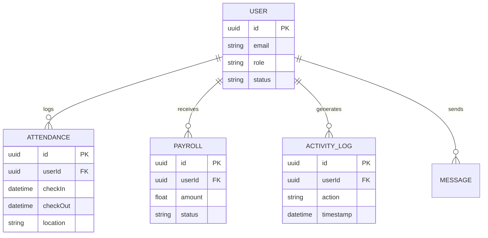

# Database Schema

## ER Diagram (Mermaid)

## Key Tables
- **Users / Employees:** Core identity records.
- **Attendance:** Timestamps for work sessions.
- **Payroll:** Monthly salary generation records.
- **Activity_Log (AuditLog):** Immutable ledger of sensitive actions.
- **Telemetry:** High-volume time-series data for GPS and system monitoring (often partitioned).
